# MedBox — Complete Pin Connection & Wiring Guide

This guide provides the definitive, complete pin connection mapping and hardware wiring instructions for the **MedBox Modular Smart Medication Dispenser**. It covers the dual-microcontroller architecture (ESP32-S3 SuperMini & ESP32-C3 SuperMini), sensors, audio indicators, power distribution rails, and all 6 servo actuators (Modules 1, 2, and 3).

---

## 1. High-Level Hardware Architecture & Interconnect Map

```mermaid
flowchart TB
    subgraph Power["🔌 Power Supply Infrastructure"]
        USBC["USB-C 5V Input (5V / 2A-3A)"]
        FUSE["Resettable Fuse (PTC) & Reverse Diode"]
        LOGIC_BUS["⚡ 5V Logic Bus"]
        SERVO_BUS["🔋 5V Dedicated Servo Rail<br/>(With 470µF 16V Capacitor)"]
        GND_BUS["⏚ Common System Ground Bus"]

        USBC --> FUSE
        FUSE --> LOGIC_BUS & SERVO_BUS
    end

    subgraph S3_Brain["🧠 ESP32-S3 SuperMini (Main IoT Brain)"]
        S3_5V["5V / VBUS Pin"]
        S3_GND["GND Pin"]
        S3_TX["GPIO 17 (UART1 TX)"]
        S3_RX["GPIO 18 (UART1 RX)"]
        S3_PROX["GPIO 5 (Digital IN)"]
        S3_BUZZ["GPIO 6 (PWM OUT)"]
    end

    subgraph C3_Motion["⚙️ ESP32-C3 SuperMini (Servo Controller)"]
        C3_5V["5V / VBUS Pin"]
        C3_GND["GND Pin"]
        C3_RX["GPIO 20 (UART0 RX)"]
        C3_TX["GPIO 21 (UART0 TX)"]
        
        M1_DISP_PIN["GPIO 0 (M1 Dispenser PWM)"]
        M1_HATCH_PIN["GPIO 1 (M1 Hatch PWM)"]
        M2_DISP_PIN["GPIO 3 (M2 Dispenser PWM)"]
        M2_HATCH_PIN["GPIO 4 (M2 Hatch PWM)"]
        M3_DISP_PIN["GPIO 5 (M3 Dispenser PWM)"]
        M3_HATCH_PIN["GPIO 6 (M3 Hatch PWM)"]
    end

    subgraph Peripherals["🔔 Sensors & Indicators"]
        IR_SENS["IR Proximity / Presence Sensor"]
        BUZZER["Piezo Electric Buzzer"]
    end

    subgraph Actuators["🦾 Servo Actuators (Module 1 - 3)"]
        M1_DISP["Module 1 Dispenser Servo"]
        M1_HATCH["Module 1 Hatch Servo"]
        M2_DISP["Module 2 Dispenser Servo"]
        M2_HATCH["Module 2 Hatch Servo"]
        M3_DISP["Module 3 Dispenser Servo"]
        M3_HATCH["Module 3 Hatch Servo"]
    end

    %% Power Wiring
    LOGIC_BUS ==> S3_5V & C3_5V & IR_SENS
    SERVO_BUS ==> M1_DISP & M1_HATCH & M2_DISP & M2_HATCH & M3_DISP & M3_HATCH
    GND_BUS === S3_GND & C3_GND & IR_SENS & BUZZER & M1_DISP & M1_HATCH & M2_DISP & M2_HATCH & M3_DISP & M3_HATCH

    %% Signal Wiring
    S3_TX --->|"Serial Commands"| C3_RX
    C3_TX --->|"Status / ACK"| S3_RX
    IR_SENS --->|"Presence Detect"| S3_PROX
    S3_BUZZ --->|"Beep Tone"| BUZZER

    %% Servo Signals
    M1_DISP_PIN ---> M1_DISP
    M1_HATCH_PIN ---> M1_HATCH
    M2_DISP_PIN ---> M2_DISP
    M2_HATCH_PIN ---> M2_HATCH
    M3_DISP_PIN ---> M3_DISP
    M3_HATCH_PIN ---> M3_HATCH
```



---

## 2. Master System Pin Connection Table

| From Component | Pin Name / No. | To Component | Target Pin | Wire Color Code | Signal Type | Description |
|:---------------|:--------------:|:-------------|:----------:|:---------------:|:-----------:|:------------|
| **Power Supply** | 5V Output | ESP32-S3 | `5V / VBUS` | 🔴 Red | 5V DC Power | Logic power for ESP32-S3 |
| **Power Supply** | 5V Output | ESP32-C3 | `5V / VBUS` | 🔴 Red | 5V DC Power | Logic power for ESP32-C3 |
| **Power Supply** | 5V Output | Servo Rail | `+5V Rail` | 🔴 Red (Thick 22AWG) | 5V DC Power | Heavy-current servo power rail |
| **Power Supply** | Ground | All Modules | `GND` | ⬛ Black (Thick 22AWG)| Common Ground | **Shared common ground reference** |
| **ESP32-S3** | `GPIO 17` | ESP32-C3 | `GPIO 20` | 🟡 Yellow / Blue | UART TX → RX | S3 Transmits move commands to C3 |
| **ESP32-S3** | `GPIO 18` | ESP32-C3 | `GPIO 21` | 🟢 Green / White | UART RX ← TX | S3 Receives execution response from C3 |
| **ESP32-S3** | `GPIO 5` | IR Sensor | `OUT / DO` | 🟣 Purple | Digital Input | Proximity sensor presence signal |
| **ESP32-S3** | `3V3` | IR Sensor | `VCC` | 🔴 Red | 3.3V DC Power | Sensor power (or 5V if 5V sensor) |
| **ESP32-S3** | `GPIO 6` | Buzzer | `+` (Positive) | 🟠 Orange | PWM Output | LEDC tone drive signal (~2700Hz) |
| **ESP32-C3** | `GPIO 0` | M1 Dispenser Servo | Signal (Pin 3) | 🟡 Yellow / Orange | PWM Signal | Module 1 metering rotor control |
| **ESP32-C3** | `GPIO 1` | M1 Hatch Servo | Signal (Pin 3) | 🟡 Yellow / Orange | PWM Signal | Module 1 retrieval door control |
| **ESP32-C3** | `GPIO 3` | M2 Dispenser Servo | Signal (Pin 3) | 🟡 Yellow / Orange | PWM Signal | Module 2 metering rotor control |
| **ESP32-C3** | `GPIO 4` | M2 Hatch Servo | Signal (Pin 3) | 🟡 Yellow / Orange | PWM Signal | Module 2 retrieval door control |
| **ESP32-C3** | `GPIO 5` | M3 Dispenser Servo | Signal (Pin 3) | 🟡 Yellow / Orange | PWM Signal | Module 3 metering rotor control |
| **ESP32-C3** | `GPIO 6` | M3 Hatch Servo | Signal (Pin 3) | 🟡 Yellow / Orange | PWM Signal | Module 3 retrieval door control |

---

## 3. Microcontroller Pinout Guides & Strapping Rules

### 3.1 ESP32-S3 SuperMini (System Brain)

```
        ESP32-S3 SuperMini Header Layout
               ┌───────────────┐
      USB-C ── │ [ ]     [ ]   │ ── 5V / VBUS  ◄── 5V Power In
        3V3 ── │ [ ]     [ ]   │ ── GND        ◄── Common Ground
    GPIO 17 ── │ [ ]     [ ]   │ ── GPIO 18    (UART1 TX → C3 RX / RX ← C3 TX)
     GPIO 5 ── │ [ ]     [ ]   │ ── GPIO 6     (GPIO 5: IR Sensor / GPIO 6: Buzzer)
               │    ESP32-S3   │
               └───────────────┘
```

#### Detailed Pin Mapping:
- **`5V / VBUS`**: Connects to the main +5V Power Rail.
- **`3V3`**: Connects to IR Proximity Sensor `VCC` (3.3V logic compliant).
- **`GND`**: Connects to Common Ground Bus.
- **`GPIO 17` (TX1)**: UART Transmit line to ESP32-C3 `GPIO 20` (RX0).
- **`GPIO 18` (RX1)**: UART Receive line from ESP32-C3 `GPIO 21` (TX0).
- **`GPIO 5`**: Digital input pin connected to IR Proximity Sensor `OUT`.
- **`GPIO 6`**: PWM pin connected to Piezo Buzzer positive terminal.

> [!CAUTION]
> **ESP32-S3 Reserved / Strapping Pins to AVOID:**
> - `GPIO 0`: Boot mode pin (Must remain HIGH during boot. Do not attach pull-down resistors).
> - `GPIO 45`: VDD_SPI Flash voltage selector.
> - `GPIO 46`: Boot log / ROM code selector.

---

### 3.2 ESP32-C3 SuperMini (Dedicated Servo Controller)

```
        ESP32-C3 SuperMini Header Layout
               ┌───────────────┐
      USB-C ── │ [ ]     [ ]   │ ── 5V / VBUS  ◄── 5V Power In
        GND ── │ [ ]     [ ]   │ ── 3V3
    GPIO 20 ── │ [ ]     [ ]   │ ── GPIO 21    (UART0 RX ← S3 TX / TX → S3 RX)
     GPIO 0 ── │ [ ]     [ ]   │ ── GPIO 1     (M1 Dispenser / M1 Hatch)
     GPIO 3 ── │ [ ]     [ ]   │ ── GPIO 4     (M2 Dispenser / M2 Hatch)
     GPIO 5 ── │ [ ]     [ ]   │ ── GPIO 6     (M3 Dispenser / M3 Hatch)
               │    ESP32-C3   │
               └───────────────┘
```

#### Detailed Pin Mapping:
- **`5V / VBUS`**: Connects to the main +5V Power Rail.
- **`GND`**: Connects to Common Ground Bus.
- **`GPIO 20` (RX0)**: UART Receive line from ESP32-S3 `GPIO 17` (TX1).
- **`GPIO 21` (TX0)**: UART Transmit line to ESP32-S3 `GPIO 18` (RX1).
- **`GPIO 0`**: PWM signal output for Module 1 Dispenser Servo.
- **`GPIO 1`**: PWM signal output for Module 1 Hatch Servo.
- **`GPIO 3`**: PWM signal output for Module 2 Dispenser Servo.
- **`GPIO 4`**: PWM signal output for Module 2 Hatch Servo.
- **`GPIO 5`**: PWM signal output for Module 3 Dispenser Servo.
- **`GPIO 6`**: PWM signal output for Module 3 Hatch Servo.

> [!WARNING]
> **ESP32-C3 Reserved / Strapping Pins to AVOID:**
> - `GPIO 2`: Strapping pin (Boot mode selector). Connecting a servo signal to GPIO 2 will cause startup voltage floating, putting the ESP32-C3 into a boot loop!
> - `GPIO 8`: Direct boot mode check pin.
> - `GPIO 9`: Onboard Boot button pin (Has internal pull-up).

---

## 4. Servo Actuator & Peripheral Wiring Breakout

### 4.1 Standard Servo Cable Wire Color Code
Standard 3-pin RC servo wires (SG90 / MG90S / TowerPro / FEETECH) follow this wire standard:

| Wire Position | Color (Standard 1) | Color (Standard 2) | Signal Name | Connection Destination |
|:-------------:|:------------------:|:------------------:|:-----------:|:-----------------------|
| **Pin 1** | 🟤 Brown | ⬛ Black | **GND** | Common System Ground Bus |
| **Pin 2** | 🔴 Red | 🔴 Red | **VCC (+5V)** | Dedicated 5V Servo Rail |
| **Pin 3** | 🟠 Orange | 🟡 Yellow | **PWM Signal** | Corresponding ESP32-C3 GPIO Pin |

---

### 4.2 Module-by-Module Servo Connection Guide

#### Module 1: Main Base Unit (Pill Container #1)
- **Dispenser Servo (Metering Rotor):**
  - Brown/Black Wire → Common GND Bus
  - Red Wire → 5V Servo Rail
  - Orange/Yellow Wire → **ESP32-C3 `GPIO 0`**
- **Hatch Servo (Access Compartment Door):**
  - Brown/Black Wire → Common GND Bus
  - Red Wire → 5V Servo Rail
  - Orange/Yellow Wire → **ESP32-C3 `GPIO 1`**

#### Module 2: Expansion Unit #1 (Pill Container #2)
- **Dispenser Servo (Metering Rotor):**
  - Brown/Black Wire → Common GND Bus
  - Red Wire → 5V Servo Rail
  - Orange/Yellow Wire → **ESP32-C3 `GPIO 3`**
- **Hatch Servo (Access Compartment Door):**
  - Brown/Black Wire → Common GND Bus
  - Red Wire → 5V Servo Rail
  - Orange/Yellow Wire → **ESP32-C3 `GPIO 4`**

#### Module 3: Expansion Unit #2 (Pill Container #3)
- **Dispenser Servo (Metering Rotor):**
  - Brown/Black Wire → Common GND Bus
  - Red Wire → 5V Servo Rail
  - Orange/Yellow Wire → **ESP32-C3 `GPIO 5`**
- **Hatch Servo (Access Compartment Door):**
  - Brown/Black Wire → Common GND Bus
  - Red Wire → 5V Servo Rail
  - Orange/Yellow Wire → **ESP32-C3 `GPIO 6`**

---

### 4.3 Sensors & Audio Indicators

#### IR Proximity / Presence Sensor (FC-51 / TCRT5000 / VL53L0X)
- **`VCC` Pin**: ESP32-S3 `3V3` Pin (or 5V if required by 5V module version)
- **`GND` Pin**: Common Ground Bus
- **`OUT / DO` Pin**: **ESP32-S3 `GPIO 5`**

#### Piezoelectric Buzzer Module
- **`+` (Positive / Signal) Pin**: **ESP32-S3 `GPIO 6`**
- **`-` (Negative / Ground) Pin**: Common Ground Bus

---

## 5. Modular Expansion Module Connector Pinout

Each physical expansion module (Modules 2 and 3) connects to the main unit using a standardized **4-Pin Connector** (JST-XH 2.54mm or Header Cable):

```
         Expansion Bus Port Pinout (Female Header on Main Box)
         ┌─────────────────────────────────────────────────────┐
         │  [Pin 1]  +5V_SERVO  ──► 5V 3A Servo Rail (Red Wire)│
         │  [Pin 2]  GND        ──► Common Ground (Black Wire) │
         │  [Pin 3]  DISP_PWM   ──► C3 GPIO 3 or 5 (Yellow)    │
         │  [Pin 4]  HATCH_PWM  ──► C3 GPIO 4 or 6 (White)     │
         └─────────────────────────────────────────────────────┘
```

---

## 6. Power Topology & Noise Isolation Guidelines

```
                             5V 3A Power Input
                                     │
                    ┌────────────────┴────────────────┐
                    ▼                                 ▼
            ┌───────────────┐                 ┌───────────────┐
            │ 5V LOGIC RAIL │                 │ 5V SERVO RAIL │
            └───────┬───────┘                 └───────┬───────┘
                    │                                 │
            ┌───────┴───────┐                 ┌───────┴───────┐
            │ ESP32-S3 / C3 │                 │ 470µF 16V Cap │
            └───────┬───────┘                 └───────┬───────┘
                    │                                 │
                    └────────────────┬────────────────┘
                                     ▼
                            Common Ground Bus
```

> [!IMPORTANT]
> ### Electrical Safety Rules:
> 1. **Common Ground:** The ground wire of the USB power input, ESP32-S3, ESP32-C3, sensor, buzzer, and all servos **must connect to a single shared Ground Bus**. Without a common ground, UART serial data and PWM signals will suffer from signal corruption.
> 2. **Decoupling Bulk Capacitor:** Solder a **470 µF / 16V Electrolytic Capacitor** across the 5V Servo Rail and GND right near the servo headers. Servos draw high stall current spikes (up to 500mA each). The capacitor prevents voltage drops that would cause the microcontrollers to reset.
> 3. **Wire Gauge:** Use minimum **22 AWG wire** for the 5V Power Rail and GND Bus. Signal wires (UART, PWM, Proximity) can use **26–28 AWG wire**.

---

## 7. Pre-Power Wiring Verification Checklist

Before plugging in the USB-C power cable, perform the following multimeter continuity and visual checks:

- [ ] **Common Ground Continuity:** Check resistance between S3 GND, C3 GND, Servo GND, and Sensor GND. Must read `< 0.5 Ω`.
- [ ] **No 5V-to-GND Short:** Measure resistance between 5V Power Rail and GND Rail. Must **NOT** be shorted (`0 Ω`).
- [ ] **UART Line Crossover:** Verify that **S3 GPIO 17 (TX)** goes to **C3 GPIO 20 (RX)**, and **S3 GPIO 18 (RX)** goes to **C3 GPIO 21 (TX)**. (TX must connect to RX!).
- [ ] **Servo Supply Separation:** Verify servo red VCC wires are connected to the 5V Servo Rail and **NOT** to the ESP32 3.3V pins.
- [ ] **Strapping Pin Isolation:** Verify that ESP32-C3 `GPIO 2` and ESP32-S3 `GPIO 0` are completely free of unexpected external pull-downs.
