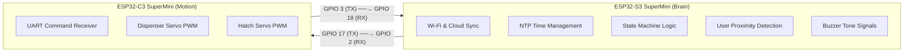
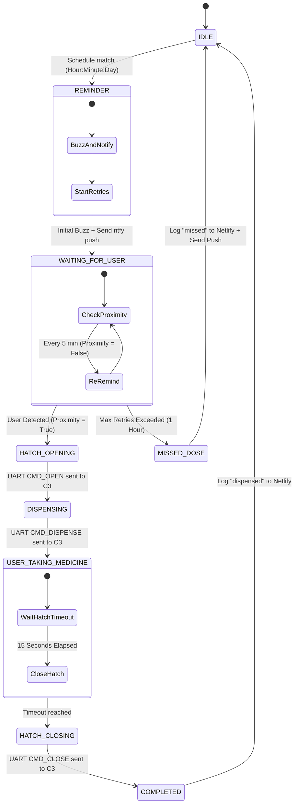
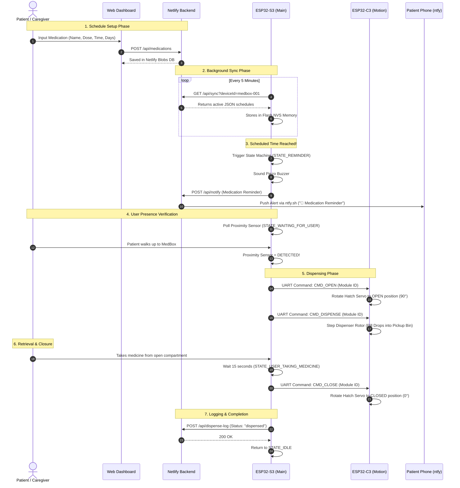
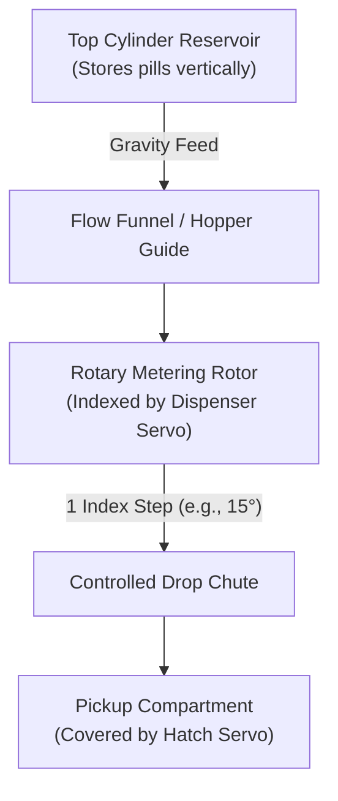

# MedBox — Complete Device Architecture & Operation Guide

This guide provides a comprehensive technical overview of the **MedBox Modular Smart Medication Dispenser**, detailing how the physical device, dual microcontrollers, mechanical dispensing system, cloud backend, and phone push notification system work together.

---

## 1. System Overview & Core Principles

The **MedBox** is an IoT-enabled, modular medication reminder and automated dispensing system. It allows users or caregivers to configure medication schedules via a Web Dashboard hosted on Netlify, while an on-board dual-controller unit handles timekeeping, proximity verification, physical dispensing, and cloud logging.

### Core Design Rules
1. **Modular Principle:** *"One medication type = One medication module."*
   - **Main Module:** Contains system electronics, Wi-Fi, timekeeper, presence sensor, buzzer, and **Module #1 dispensing hardware**.
   - **Expansion Modules:** Purely mechanical expansion units containing Module #2 and Module #3 dispensing hardware (driven by the central controller).
2. **Safety-First Dispensing:** The hatch **never opens** and pills are **never dropped** unless the proximity sensor detects a user in front of the box.
3. **Offline Resilience:** Schedules are synced from Netlify to the ESP32-S3's non-volatile Flash memory (NVS). Once synced, the MedBox dispenses accurately even if Wi-Fi or internet connection drops.

---

## 2. High-Level System Architecture

```mermaid
flowchart TB
    subgraph Cloud["🌐 Cloud Layer (Netlify + ntfy)"]
        UI["Web Dashboard<br/>(HTML/JS Frontend)"]
        API["Netlify Serverless Functions<br/>(/api/sync, /api/notify, /api/dispense-log)"]
        DB[("Netlify Blob Storage<br/>(Schedules & History)")]
        NTFY["ntfy.sh Server"]
        UI <--> API
        API <--> DB
        API --> NTFY
    end

    subgraph Phone["📱 User Mobile Phone"]
        APP["ntfy App / Phone Alerts"]
        NTFY -->|"Push Notification"| APP
    end

    subgraph Hardware["📦 MedBox Physical Device (Main + Expansions)"]
        subgraph S3_Brain["ESP32-S3 SuperMini (Main IoT Brain)"]
            WIFI["Wi-Fi / HTTPS Client"]
            NTP["NTP Time Sync"]
            NVS["NVS Local Schedule Storage"]
            SM["Medication State Machine"]
            PROX["Proximity / IR Sensor"]
            BUZZ["Piezo Buzzer"]
        end

        subgraph C3_Motion["ESP32-C3 SuperMini (Servo Controller)"]
            UART_RX["UART Command Parser"]
            PWM["Servo PWM Driver"]
        end

        subgraph Actuators["Mechanical Modules (Servos & Motors)"]
            M1_DISP["Module 1 Dispenser Servo"]
            M1_HATCH["Module 1 Hatch Servo"]
            M2_DISP["Module 2 Dispenser Servo"]
            M2_HATCH["Module 2 Hatch Servo"]
            M3_DISP["Module 3 Dispenser Servo"]
            M3_HATCH["Module 3 Hatch Servo"]
        end

        S3_Brain <-->|"Hardware UART (115200 Baud)"| C3_Motion
        C3_Motion --> PWM
        PWM --> M1_DISP & M1_HATCH & M2_DISP & M2_HATCH & M3_DISP & M3_HATCH
        PROX --> SM
        BUZZ <-- SM
    end

    API <-->|"HTTPS GET /api/sync<br/>POST /api/dispense-log<br/>POST /api/notify"| WIFI
```

---

## 3. Microcontroller Responsibilities & Hardware Interconnects

The MedBox separates high-level IoT logic from low-level motor actuation across two microcontrollers:



### 3.1 ESP32-S3 SuperMini (System Brain)
- **Wi-Fi Provisioning:** Runs a SoftAP captive portal (`MedBox_WiFi`) on first boot for home Wi-Fi setup.
- **Schedule Sync:** Periodically fetches active schedules from `https://YOUR-SITE.netlify.app/api/sync` every 5 minutes.
- **Time Sync:** Connects to `pool.ntp.org` to maintain localized real-time clock (UTC+8).
- **Proximity Gatekeeper:** Continuously polls the IR/proximity sensor (`GPIO 5`) during alarm windows.
- **Audio Feedback:** Drives the piezo buzzer (`GPIO 6`) for reminder beeps.
- **UART Master:** Transmits binary packets (`CMD_OPEN`, `CMD_DISPENSE`, `CMD_CLOSE`) to the ESP32-C3.

### 3.2 ESP32-C3 SuperMini (Dedicated Servo Controller)
- Accepts single-byte UART commands from the ESP32-S3.
- Precise pulse-width modulation (PWM) control for up to **6 servos** (3 dispenser servos + 3 hatch servos).
- Prevents motor electrical noise and PWM timing jitter from interfering with S3 Wi-Fi stack.

---

## 4. Electrical & Power Topology

```mermaid
block-beta
    columns 3
    block:USB["🔌 USB-C Power Input (5V / 2A-3A)"]:3
    end
    space Protection["Protection Circuit<br/>(Fuse / Reverse Diode)"] space
    block:LogicBus["⚡ 5V Main Power Rail"]:3
    end
    block:LDO["3.3V LDO Regulator"]:1
    block:ServoBus["Servo Power Bus (5V)"]:2
    end
    block:MCU1["ESP32-S3"]:1
    block:MCU2["ESP32-C3"]:1
    block:Servos["Servos (Module 1-3)"]:1
    end

    USB --> Protection
    Protection --> LogicBus
    LogicBus --> LDO
    LogicBus --> ServoBus
    LDO --> MCU1
    LDO --> MCU2
    ServoBus --> Servos
```

> [!IMPORTANT]
> **Common Ground:** All GND pins (ESP32-S3, ESP32-C3, Servos, Power Supply) must share a common reference ground. Servo power is tapped directly from the 5V bus, **never through microcontrollers' internal 3.3V/5V pin outputs**.

---

## 5. Firmware State Machine & Medication Flow

When a scheduled intake time arrives, the ESP32-S3 executes the following finite state machine:



---

## 6. End-to-End Operation Sequence Diagram

The diagram below maps the complete journey from user schedule configuration on the website to pill retrieval and cloud log confirmation:



---

## 7. Mechanical Dispensing Mechanism

Each medication module relies on a gravity-fed cylindrical container paired with an anti-double-feed rotary metering rotor:



### Key Mechanical Principles
1. **Gravity Reservoir:** Eliminates complex augers/screws across the main storage volume.
2. **Rotary Pocket Geometry:** The rotor pockets are sized to accommodate one tablet/capsule per position.
3. **Mechanical Anti-Double-Feed:** The rotor wall physically blocks subsequent pills from falling until the next indexing step.
4. **Dual Servo Action per Module:**
   - **Dispenser Servo:** Rotates rotor indexed steps to meter doses.
   - **Hatch Servo:** Opens access door only during active retrieval window.

---

## 8. Summary Checklist for Setup & Verification

| Component | Task | Status Check |
|-----------|------|--------------|
| **Netlify Backend** | Linked repo, imported `.env` (`NTFY_TOPIC=med-box-notification`) | Visit `/api/sync?deviceId=medbox-001` → JSON output |
| **ntfy App** | Installed on phone, subscribed to `med-box-notification` | Press **🔔 Send Test Alert** on Website Settings page |
| **ESP32-S3 Firmware** | Flashed `medbox_s3.ino` + LittleFS data files | Serial Monitor shows `API sync: fetched N schedules` |
| **ESP32-C3 Firmware** | Flashed `medbox_c3.ino` | Serial Monitor shows `UART Command Received` |
| **Hardware Wiring** | Shared GND, S3 TX:17 → C3 RX:2, S3 RX:18 ← C3 TX:3 | Motors move on test command |
