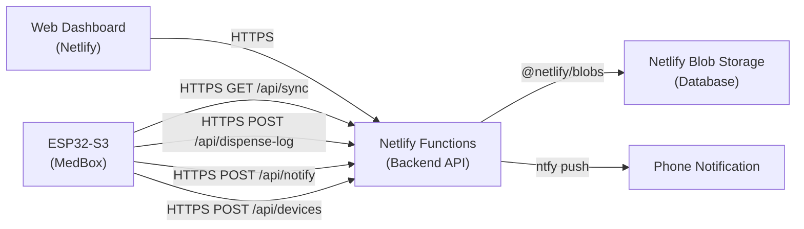
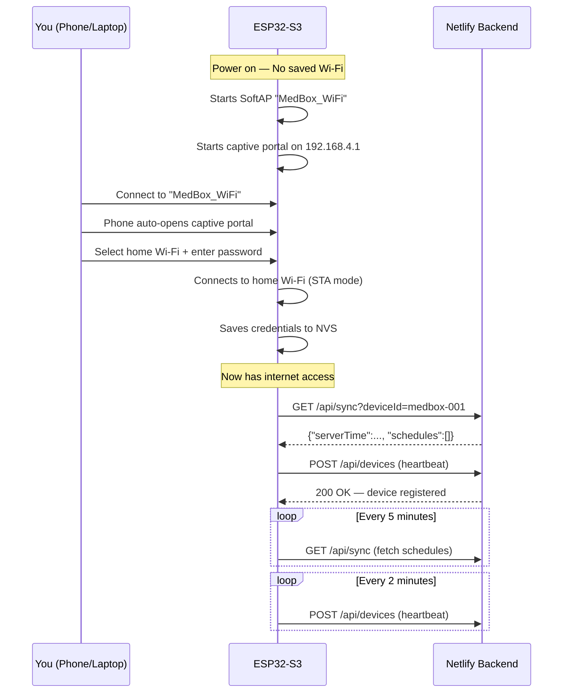

# MedBox — ESP32 + Netlify Setup Guide

This guide walks you through everything needed to get your ESP32-S3 talking to your Netlify-hosted web dashboard. Your codebase already has all the integration code written — this guide covers the **deployment and configuration** steps to make it all work together.

---

## Architecture Recap



Your ESP32-S3 acts as an HTTPS **client** — it periodically calls your Netlify Functions to sync schedules, log events, and send heartbeats. There is **no inbound connection** to the ESP32.

---

## Part 1: Netlify Setup

### 1.1 Prerequisites

- A [Netlify](https://www.netlify.com/) account (free tier works)
- A [GitHub](https://github.com/) account
- [Node.js](https://nodejs.org/) v18+ installed locally
- [Netlify CLI](https://docs.netlify.com/cli/get-started/) installed:
  ```bash
  npm install -g netlify-cli
  ```

### 1.2 Push Your Repo to GitHub

If your repo isn't already on GitHub:

```bash
cd D:\JCTalosig\Projects\MedDispenser
git remote add origin https://github.com/YOUR_USERNAME/MedDispenser.git
git push -u origin main
```

### 1.3 Create the Netlify Site

**Option A: Via Netlify Dashboard (Recommended)**

1. Go to [app.netlify.com](https://app.netlify.com)
2. Click **"Add new site"** → **"Import an existing project"**
3. Connect to GitHub and select your **MedDispenser** repo
4. Configure the build settings:

   | Setting | Value |
   |---------|-------|
   | **Base directory** | `MedDispenser/web` |
   | **Publish directory** | `MedDispenser/web/frontend` |
   | **Functions directory** | `MedDispenser/web/netlify/functions` |

5. Click **"Deploy site"**

> [!IMPORTANT]
> The **Base directory** must be set to `MedDispenser/web` because your [netlify.toml](file:///d:/JCTalosig/Projects/MedDispenser/MedDispenser/web/netlify.toml) paths are relative to the `web/` folder. Without this, Netlify won't find your functions or frontend.

**Option B: Via CLI**

```bash
cd D:\JCTalosig\Projects\MedDispenser\MedDispenser\web

# Install dependencies first
npm install

# Login to Netlify
netlify login

# Link to a new site
netlify init
```

When prompted:
- Choose **"Create & configure a new site"**
- Set team and site name (e.g., `modular-med-dispenser`)
- Build command: *(leave blank — no build step needed for static HTML)*
- Publish directory: `frontend`

### 1.4 Set Your Custom Site Name

Your firmware's [config.h](file:///d:/JCTalosig/Projects/MedDispenser/MedDispenser/firmware/medbox_s3/config.h#L45) is pre-configured to:

```cpp
#define API_BASE_URL  "https://modular-med-dispenser.netlify.app"
```

To match this:
1. Go to **Site settings** → **Domain management** → **Production domains**
2. Click **"Options"** → **"Edit site name"**
3. Set it to: `modular-med-dispenser`

Or, update `API_BASE_URL` in [config.h](file:///d:/JCTalosig/Projects/MedDispenser/MedDispenser/firmware/medbox_s3/config.h#L45) to match whatever Netlify assigns you.

### 1.5 Verify Deployment

After deployment, verify these endpoints work:

| Endpoint | Expected Response |
|----------|-------------------|
| `https://YOUR-SITE.netlify.app/` | Dashboard HTML page loads |
| `https://YOUR-SITE.netlify.app/api/sync?deviceId=test` | `{"serverTime":..., "schedules":[]}` |
| `https://YOUR-SITE.netlify.app/api/devices` | `[]` (empty array) |
| `https://YOUR-SITE.netlify.app/api/medications` | `[]` (empty array) |

### 1.6 Test Locally (Optional)

You can test the full stack locally before deploying:

```bash
cd D:\JCTalosig\Projects\MedDispenser\MedDispenser\web
npm install
netlify dev
```

This starts a local server at `http://localhost:8888` with working Netlify Functions and Blob storage emulation.

---

## Part 2: ESP32-S3 Firmware Setup

### 2.1 Prerequisites

- **Arduino IDE 2.x** (or PlatformIO)
- **ESP32-S3 SuperMini** board
- A USB-C cable for flashing

### 2.2 Install Arduino ESP32 Board Package

1. Open **Arduino IDE** → **File** → **Preferences**
2. In **"Additional Boards Manager URLs"**, add:
   ```
   https://raw.githubusercontent.com/espressif/arduino-esp32/gh-pages/package_esp32_index.json
   ```
3. Go to **Tools** → **Board** → **Boards Manager**
4. Search for **"esp32"** and install **"esp32 by Espressif Systems"** (v3.x recommended)
5. Select your board: **Tools** → **Board** → **ESP32S3 Dev Module** (or closest match for SuperMini)

### 2.3 Install Required Libraries

Install these via **Sketch** → **Include Library** → **Manage Libraries**:

| Library | Purpose |
|---------|---------|
| **ArduinoJson** (v7+) | JSON parsing for API responses |
| **ESPAsyncWebServer** | Captive portal web server |
| **AsyncTCP** | Dependency for ESPAsyncWebServer |

> [!NOTE]
> `HTTPClient`, `WiFiClientSecure`, `WiFi`, `DNSServer`, `LittleFS`, and `Preferences` are **built-in** to the ESP32 Arduino core — no separate install needed.

### 2.4 Board Configuration

In **Tools** menu, set:

| Setting | Value |
|---------|-------|
| **Board** | ESP32S3 Dev Module |
| **USB CDC On Boot** | Enabled |
| **Flash Size** | 4MB (or whatever your board has) |
| **Partition Scheme** | Default 4MB with spiffs (or with LittleFS) |
| **Upload Speed** | 921600 |

### 2.5 Upload the Captive Portal Files to LittleFS

Your WiFi manager serves a captive portal from LittleFS. You need to upload the portal HTML files from [data/](file:///d:/JCTalosig/Projects/MedDispenser/MedDispenser/firmware/medbox_s3/data) to the ESP32's filesystem.

1. Install the **ESP32 LittleFS Uploader** plugin for Arduino IDE
   - For Arduino IDE 2.x: Use [arduino-littlefs-upload](https://github.com/earlephilhower/arduino-littlefs-upload)
2. Place your captive portal HTML/CSS/JS files in `firmware/medbox_s3/data/`
3. Upload: **Tools** → **ESP32 Sketch Data Upload** (selects LittleFS partition)

### 2.6 Update config.h

Open [config.h](file:///d:/JCTalosig/Projects/MedDispenser/MedDispenser/firmware/medbox_s3/config.h) and verify/update these values:

```cpp
// Must match your Netlify site URL exactly
#define API_BASE_URL      "https://YOUR-SITE.netlify.app"

// Unique ID for this physical MedBox unit
#define API_DEVICE_ID     "medbox-001"

// Your timezone offset (currently set to UTC+8 for Philippines)
#define NTP_GMT_OFFSET_SEC  28800
```

### 2.7 Flash the Firmware

1. Connect ESP32-S3 via USB-C
2. Open [medbox_s3.ino](file:///d:/JCTalosig/Projects/MedDispenser/MedDispenser/firmware/medbox_s3/medbox_s3.ino)
3. Click **Upload** (→ button)
4. Open **Serial Monitor** at 115200 baud to watch boot logs

---

## Part 3: First-Time Connection Flow

Once the firmware is flashed, here's what happens:



### Step-by-Step:

1. **Power on** the ESP32-S3
2. It will create a Wi-Fi network called **`MedBox_WiFi`**
3. **Connect** your phone or laptop to `MedBox_WiFi`
4. A captive portal page should auto-open (or navigate to `192.168.4.1`)
5. **Select your home Wi-Fi** from the scan results and enter the password
6. The ESP32 connects to your Wi-Fi, saves the credentials, and shuts down the AP
7. It immediately begins syncing with your Netlify backend

### Verify Connection:

Open Serial Monitor — you should see:

```
[WIFI] Connected to saved network!
API client initialized
API sync: GET https://modular-med-dispenser.netlify.app/api/sync?deviceId=medbox-001
API sync: fetched 0 schedules
Heartbeat sent
```

---

## Part 4: Using the System

### 4.1 Add a Medication via the Web Dashboard

1. Open your Netlify site URL in a browser
2. Navigate to the **Medications** page
3. Add a medication:
   - Name, module number (1–3), dose count, time, schedule days
4. The medication is stored in Netlify Blob Storage

### 4.2 ESP32 Picks Up the Schedule

- The ESP32 polls `/api/sync` every **5 minutes** (configurable via `API_SYNC_INTERVAL_MS`)
- On sync, it downloads all enabled medications and stores them locally in NVS
- Even if Wi-Fi drops, the ESP32 continues operating from its local schedule copy

### 4.3 At Medication Time

1. ESP32 detects it's time → activates buzzer → sends ntfy push notification
2. Waits for proximity sensor to detect the user
3. Sends UART command to ESP32-C3 → opens hatch → dispenses pills
4. Logs the event via `POST /api/dispense-log`

---

## Part 5: Troubleshooting

### ESP32 can't reach Netlify

| Symptom | Fix |
|---------|-----|
| `API sync failed, HTTP -1` | Wi-Fi connected but DNS/TLS issue. Check that `setInsecure()` is called (already done in your code). Ensure your router has internet access. |
| `API sync failed, HTTP 404` | Your Netlify base URL or API redirect paths are wrong. Verify the site name matches `API_BASE_URL`. |
| `API sync failed, HTTP 500` | Backend function error. Check Netlify Functions logs at **Netlify Dashboard** → **Functions** → click the function → view logs. |
| `[WIFI] Saved network failed` | Wrong password or SSID changed. The ESP32 will automatically fall back to AP mode so you can re-enter credentials. |

### Netlify Functions Not Working

1. Check **Netlify Dashboard** → **Functions** tab — all 6 functions should appear:
   - `devices`, `dispense-log`, `medications`, `notify`, `schedules`, `sync`
2. If missing, verify the **Base directory** is set to `MedDispenser/web` in site settings
3. Check the **Functions log** for runtime errors

### Reset Wi-Fi on ESP32

If you need to re-provision Wi-Fi, you can:
- Call `wifiForgetNetwork()` in your code (triggered by a button, etc.)
- Or manually erase NVS: **Tools** → **Erase All Flash Before Sketch Upload** → re-upload

---

## Part 6: ESP32-C3 (Servo Controller) Setup

The C3 firmware is in [firmware/medbox_c3/](file:///d:/JCTalosig/Projects/MedDispenser/MedDispenser/firmware/medbox_c3). It's simpler since it only receives UART commands from the S3.

1. Select board: **ESP32C3 Dev Module**
2. Flash [the C3 firmware](file:///d:/JCTalosig/Projects/MedDispenser/MedDispenser/firmware/medbox_c3)
3. Wire UART between S3 and C3:

```
ESP32-S3 GPIO 17 (TX) ──→ ESP32-C3 RX
ESP32-S3 GPIO 18 (RX) ←── ESP32-C3 TX
Common GND ─────────────── GND
```

> [!WARNING]
> Pin assignments in [config.h](file:///d:/JCTalosig/Projects/MedDispenser/MedDispenser/firmware/medbox_s3/config.h#L18-L19) are marked as **NOT FINALIZED**. Verify against your actual board's available GPIOs before wiring.

---

## Quick Reference: API Endpoints

| Endpoint | Method | Who Calls | Purpose |
|----------|--------|-----------|---------|
| `/api/sync` | GET | ESP32 | Fetch medication schedules |
| `/api/dispense-log` | POST | ESP32 | Log a dispense event |
| `/api/notify` | POST | ESP32 | Trigger ntfy push notification |
| `/api/devices` | GET/POST | ESP32 + Web | Device registration & heartbeat |
| `/api/medications` | GET/POST | Web UI | CRUD medications |
| `/api/schedules` | GET | Web UI | View schedule calendar |

---

## Summary Checklist

- [ ] Push repo to GitHub
- [ ] Create Netlify site linked to the repo (base dir: `MedDispenser/web`)
- [ ] Set site name to match `API_BASE_URL` in config.h (or update config.h)
- [ ] Verify Netlify endpoints return valid JSON
- [ ] Install Arduino ESP32 board package + required libraries
- [ ] Update `API_BASE_URL` in config.h if needed
- [ ] Flash LittleFS data (captive portal files)
- [ ] Flash medbox_s3.ino to ESP32-S3
- [ ] Connect to `MedBox_WiFi` AP and provision home Wi-Fi
- [ ] Verify sync via Serial Monitor
- [ ] Add medications via web dashboard
- [ ] Confirm ESP32 picks up schedules on next sync
