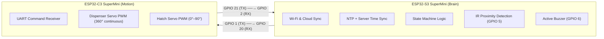
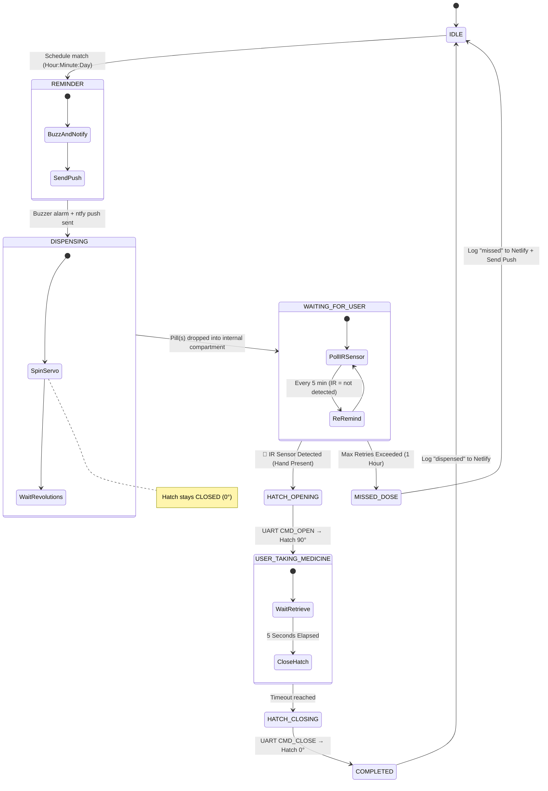
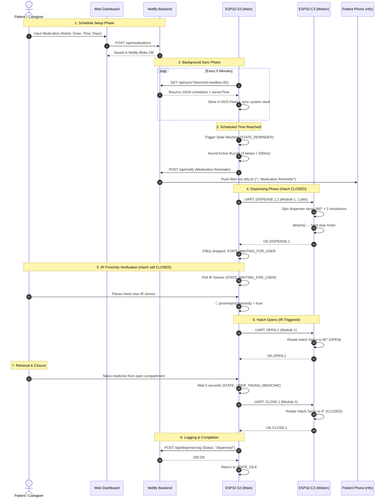
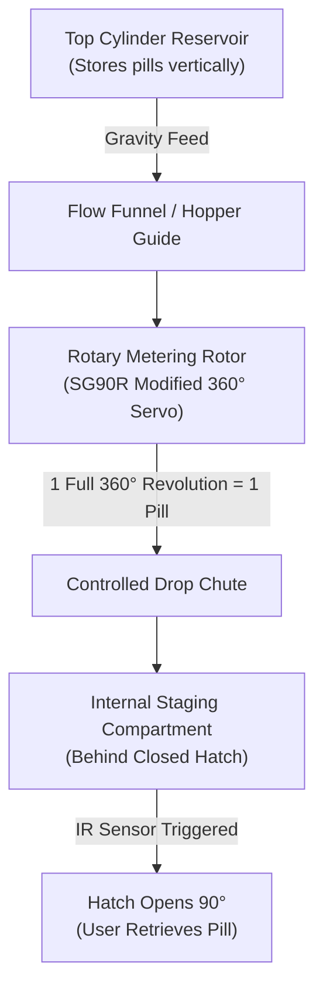

# MedBox — Complete Device Architecture & Operation Guide

> **Last Updated:** 2026-08-22 — Reflects IR-gated hatch opening, dispense-first flow, correct UART pins, modified 360° servo, active buzzer, dual time sync, and all recent firmware fixes.

This guide provides a comprehensive technical overview of the **MedBox Modular Smart Medication Dispenser**, detailing how the physical device, dual microcontrollers, mechanical dispensing system, cloud backend, and phone push notification system work together.

---

## 1. System Overview & Core Principles

The **MedBox** is an IoT-enabled, modular medication reminder and automated dispensing system. It allows users or caregivers to configure medication schedules via a Web Dashboard hosted on Netlify, while an on-board dual-controller unit handles timekeeping, proximity verification, physical dispensing, and cloud logging.

### Core Design Rules
1. **Modular Principle:** *"One medication type = One medication module."*
   - **Main Module:** Contains system electronics, Wi-Fi, timekeeper, presence sensor, buzzer, and **Module #1 dispensing hardware**.
   - **Expansion Modules:** Purely mechanical expansion units containing Module #2 and Module #3 dispensing hardware (driven by the central controller).
2. **IR-Gated Safety:** The hatch **never opens** unless the IR proximity sensor detects a user's hand in front of the box. Pills are dispensed behind a closed hatch first, then the hatch opens only on IR trigger.
3. **Offline Resilience:** Schedules are synced from Netlify to the ESP32-S3's non-volatile Flash memory (NVS). Once synced, the MedBox dispenses accurately even if Wi-Fi or internet connection drops.

---

## 2. High-Level System Architecture

```mermaid
flowchart TB
    subgraph Cloud["🌐 Cloud Layer (Netlify + ntfy)"]
        UI["Web Dashboard<br/>(HTML/JS Frontend)"]
        API["Netlify Serverless Functions<br/>(/api/sync, /api/notify, /api/dispense-log)"]
        DB[("Netlify Blob Storage<br/>(Schedules & History)")]
        NTFY["ntfy.sh Server"]
        UI <--> API
        API <--> DB
        API --> NTFY
    end

    subgraph Phone["📱 User Mobile Phone"]
        APP["ntfy App / Phone Alerts"]
        NTFY -->|"Push Notification"| APP
    end

    subgraph Hardware["📦 MedBox Physical Device (Main + Expansions)"]
        subgraph S3_Brain["ESP32-S3 SuperMini (Main IoT Brain)"]
            WIFI["Wi-Fi / HTTP(S) Client"]
            NTP["NTP + Server Time Sync"]
            NVS["NVS Local Schedule Storage"]
            SM["Medication State Machine"]
            PROX["IR Proximity Sensor (GPIO 5)"]
            BUZZ["Active Buzzer (GPIO 6)"]
        end

        subgraph C3_Motion["ESP32-C3 SuperMini (Servo Controller)"]
            UART_RX["UART Command Parser"]
            PWM["Servo PWM Driver"]
        end

        subgraph Actuators["Mechanical Modules (Servos & Motors)"]
            M1_DISP["Module 1 Dispenser Servo (360°)"]
            M1_HATCH["Module 1 Hatch Servo (0°–90°)"]
            M2_DISP["Module 2 Dispenser Servo (360°)"]
            M2_HATCH["Module 2 Hatch Servo (0°–90°)"]
            M3_DISP["Module 3 Dispenser Servo (360°)"]
            M3_HATCH["Module 3 Hatch Servo (0°–90°)"]
        end

        S3_Brain <-->|"Hardware UART (115200 Baud)<br/>S3 TX:GPIO1 → C3 RX:GPIO20<br/>S3 RX:GPIO2 ← C3 TX:GPIO21"| C3_Motion
        C3_Motion --> PWM
        PWM --> M1_DISP & M1_HATCH & M2_DISP & M2_HATCH & M3_DISP & M3_HATCH
        PROX --> SM
        BUZZ <-- SM
    end

    API <-->|"HTTP(S) GET /api/sync<br/>POST /api/dispense-log<br/>POST /api/notify<br/>GET /api/dispense-command"| WIFI
```

---

## 3. Microcontroller Responsibilities & Hardware Interconnects

The MedBox separates high-level IoT logic from low-level motor actuation across two microcontrollers:



### 3.1 ESP32-S3 SuperMini (System Brain)
- **Wi-Fi Provisioning:** Runs a SoftAP captive portal (`MedBox_WiFi`) on first boot for home Wi-Fi setup.
- **Schedule Sync:** Periodically fetches active schedules from backend API every 5 minutes.
- **Time Sync (Dual-Path):**
  - **Primary:** NTP via `pool.ntp.org` (UTC+8, retries every 5 seconds until synced)
  - **Fallback:** Server epoch from `/api/sync` response → `timeSetEpoch()` sets system clock instantly
- **IR Proximity Gatekeeper:** Continuously polls the IR proximity sensor (`GPIO 5`) during `STATE_WAITING_FOR_USER`. Hatch opens **ONLY** when hand is detected.
- **Active Buzzer:** Drives active buzzer (`GPIO 6`) via `digitalWrite(HIGH/LOW)` — NOT PWM.
- **UART Master:** Transmits text commands (`DISPENSE,N,count`, `OPEN,N`, `CLOSE,N`) to the ESP32-C3.
- **Command Polling:** Polls `/api/dispense-command` every 10 seconds for hardware test commands from the web Settings panel.

### 3.2 ESP32-C3 SuperMini (Dedicated Servo Controller)
- Uses `HardwareSerial(0)` on GPIO 20/21 (ESP32-C3 has only 1 UART peripheral)
- **USB CDC On Boot = Enabled** in Arduino IDE board settings
- Parses text UART commands and controls up to **6 servos** (3 dispenser + 3 hatch)
- Dispenser servos use `attach()` → `write(180)` → `delay(2400ms)` → `detach()` per revolution
- Hatch servos use standard `attach()` → `write(angle)` → `delay(300ms)` → `detach()`

---

## 4. Electrical & Power Topology

```mermaid
block-beta
    columns 3
    block:USB["🔌 USB-C Power Input (5V / 2A-3A)"]:3
    end
    space Protection["Protection Circuit<br/>(Fuse / Reverse Diode)"] space
    block:LogicBus["⚡ 5V Main Power Rail"]:3
    end
    block:LDO["3.3V LDO Regulator"]:1
    block:ServoBus["Servo Power Bus (5V)"]:2
    end
    block:MCU1["ESP32-S3"]:1
    block:MCU2["ESP32-C3"]:1
    block:Servos["Servos (Module 1-3)"]:1
    end

    USB --> Protection
    Protection --> LogicBus
    LogicBus --> LDO
    LogicBus --> ServoBus
    LDO --> MCU1
    LDO --> MCU2
    ServoBus --> Servos
```

> [!IMPORTANT]
> **Common Ground:** All GND pins (ESP32-S3, ESP32-C3, Servos, Power Supply) must share a common reference ground. Servo power is tapped directly from the 5V bus, **never through microcontrollers' internal 3.3V/5V pin outputs**.

---

## 5. Firmware State Machine & Medication Flow

When a scheduled intake time arrives, the ESP32-S3 executes the following finite state machine:



### Key Behavioral Rules

| Rule | Detail |
|------|--------|
| **Dispense-First** | Dispenser servo spins behind closed hatch. Pills drop into internal staging compartment. |
| **IR-Gated Hatch** | Hatch opens ONLY when `proximityIsDetected() == true`. Never opens automatically with buzzer/dispenser. |
| **UART Spam Prevention** | `_cmdSentInState` flag ensures each UART command is sent exactly once per state entry. Resets in `_enterState()`. |
| **Multi-Pill Dosing** | `uartSendCommandEx(CMD_DISPENSE, moduleId, pillsPerDose)` sends pill count to C3. C3 executes N consecutive revolutions. |

---

## 6. End-to-End Operation Sequence Diagram



---

## 7. Mechanical Dispensing Mechanism

Each medication module relies on a gravity-fed cylindrical container paired with a modified SG90R 360° continuous rotation servo:



### Key Mechanical Principles
1. **Gravity Reservoir:** Eliminates complex augers/screws across the main storage volume.
2. **Full 360° Revolution Per Pill:** The modified SG90R servo (potentiometer removed, stopper removed) makes exactly 1 full revolution per pill dose. Multiple pills = multiple revolutions.
3. **Mechanical Anti-Double-Feed:** The rotor wall physically blocks subsequent pills from falling until the next revolution completes.
4. **Dual Servo Action per Module:**
   - **Dispenser Servo (SG90R 360°):** Rotates 360° per pill behind closed hatch. Uses `write(180)` for full speed → `detach()` for hard stop.
   - **Hatch Servo (SG90 Standard):** Opens to 90° ONLY when IR sensor is triggered. Returns to 0° after 5-second retrieval window.

### Servo Control Method (Modified SG90R)

```
Per pill revolution:
  attach(pin)         → Connect PWM signal
  write(180)          → Full speed forward
  delay(2400ms)       → Wait for 1 complete 360° revolution
  detach()            → Cut PWM = instant motor stop

Repeat for each pill in dose (300ms pause between revolutions)
```

> [!WARNING]
> **Why `detach()` instead of `write(90)`?** The SG90R has its internal potentiometer disconnected. Without potentiometer feedback, the servo's internal controller cannot find "center" (90°). Sending `write(90)` results in continuous creep/spin. Only `detach()` fully cuts the PWM pulse stream, forcing the motor driver IC to power off the motor coils.

---

## 8. Web Dashboard & Schedule Checker

The Web Dashboard runs a **client-side schedule checker** that operates independently of the ESP32:

| Feature | Detail |
|---------|--------|
| **Check Interval** | Every 30 seconds via `setInterval` |
| **Scope** | Runs on **ALL pages** (dashboard, medications, settings, history) |
| **Deduplication** | Uses `Set()` with date-keyed trigger IDs to prevent duplicate triggers |
| **Action** | When schedule time matches → sends browser notification + `POST /api/dispense-command` |
| **ESP32 Pickup** | ESP32-S3 polls `/api/dispense-command` every 10 seconds and executes the command |

### Hardware Test Panel (Settings Page)

The Settings page includes a Hardware Test Panel for manual testing:
- **Ping Test** — Sends `PING,0` to verify S3 ↔ C3 UART communication
- **Buzzer Test** — Triggers active buzzer on ESP32-S3
- **Hatch Open/Close** — Sends `OPEN,N` / `CLOSE,N` for each module
- **Dispense Test** — Sends `DISPENSE,N,count` with selectable pill count (1-3)
- **IR Sensor Test** — Reads proximity sensor state

---

## 9. Summary Checklist for Setup & Verification

| Component | Task | Status Check |
|-----------|------|--------------|
| **Netlify Backend** | Linked repo, imported `.env` (`NTFY_TOPIC=med-box-notification`) | Visit `/api/sync?deviceId=medbox-001` → JSON output |
| **ntfy App** | Installed on phone, subscribed to `med-box-notification` | Press **🔔 Send Test Alert** on Website Settings page |
| **ESP32-S3 Firmware** | Flashed `medbox_s3.ino` | Serial Monitor shows `NTP synced` or `System time synced from server` |
| **ESP32-C3 Firmware** | Flashed `medbox_c3.ino` (USB CDC On Boot = Enabled) | Serial Monitor shows `Servo controller initialized: 3 modules attached` |
| **Hardware Wiring** | Shared GND, S3 TX:GPIO1 → C3 RX:GPIO20, S3 RX:GPIO2 ← C3 TX:GPIO21 | Serial shows `PONG sent` on ping test |
| **IR Sensor** | Connected to S3 GPIO 5, active LOW | Place hand near sensor → Serial shows `IR Sensor Activated!` |
| **Active Buzzer** | Connected to S3 GPIO 6, direct digitalWrite | Press buzzer test button → buzzer sounds |
| **Dispenser Servo** | SG90R modified (potentiometer removed, stopper removed) on C3 GPIO 0 | Press dispense test → servo completes 1 full 360° revolution and stops |
| **Hatch Servo** | Standard SG90 on C3 GPIO 1 | Press open test → hatch opens 90°, close test → returns to 0° |

---

## 10. Revision History

| Date | Change |
|------|--------|
| 2026-08-22 | Updated state machine: dispense-first flow, IR-gated hatch opening |
| 2026-08-22 | Fixed UART pins: S3 GPIO 1 (TX) / GPIO 2 (RX) ↔ C3 GPIO 20 (RX) / GPIO 21 (TX) |
| 2026-08-22 | Added `uartSendCommandEx()` for multi-pill dose count passthrough (`DISPENSE,N,count`) |
| 2026-08-22 | Fixed modified SG90R 360° servo: `write(180)` + `detach()` hard stop |
| 2026-08-22 | Fixed active buzzer: `digitalWrite(HIGH/LOW)` instead of PWM `ledcWrite` |
| 2026-08-22 | Fixed UART command spam: added `_cmdSentInState` flag, resets in `_enterState()` |
| 2026-08-22 | Fixed ESP32-C3 UART: uses `HardwareSerial(0)` on pins 20/21 (C3 has only 1 UART) |
| 2026-08-22 | Fixed NTP retry: reduced from 60s to 5s; added `timeSetEpoch()` from server sync |
| 2026-08-22 | Fixed web schedule checker: now runs on ALL pages, not just dashboard |
| 2026-08-22 | Added HTTP/HTTPS dual compatibility in `api_client.cpp` |
| 2026-08-22 | Added Hardware Test Panel on Settings page |
